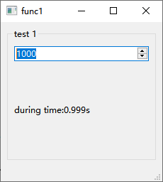

[TOC]

#  func1, 计算延时

```c++
QElapsedTimer timer;
timer.start();
timer.elapsed()
```



#  func2, 正则

## QRegularExpression

```c++
QRegularExpression regex;
regex.setPattern(filter);
QRegularExpressionMatch match = regex.match(line.trimmed());
if (match.hasMatch()) {
    matched_lines << line;
}
```


## 捕获列表

```c++
 //match.captured(0)	整个匹配的文本
// match.captured(n)	第 n 个捕获组内容（从 1 开始）
// regex.captureCount()	捕获组数量（不含 group 0）
```

```c++
 QRegularExpressionMatch match = regex.match(line.trimmed());
        QStringList captured_lines;
        if (match.hasMatch()) {
            auto cnt = regex.captureCount();// 不含group 0
            // 如果没有捕获列表,match.captured(0)是空的
            // 所有这里只能 << line, 不能match.captured(0)
            matched_lines << line;
            for (int i = 0; i < cnt; ++i) {
                captured_lines << match.captured(i + 1);
            }
            ui->out_capture->append(captured_lines.join(","));
        }
```

